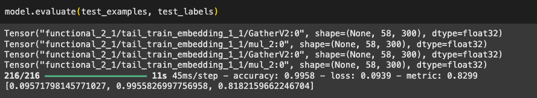

# I Spy Tickers (Public Company Finder)

## Summary

- Crawled financial news site for articles about public companies and scraped over 30,000 articles using Selenium
- Cleaned, processed, and labeled data using custom algorithm
- Created bidirectional LSTM in Tensorflow/Keras with custom data loading, custom embedding layer to train certain embeddings on the fly, and custom loss function
- Achieved F1 metric of .818 during evaluation despite heavily imbalanced data (~3.15% labels positive), error analysis indicated artificially low evaluation metric due to mislabeled data

A few years ago, I worked on a data science project that scraped influential Twitter accounts, looked for public companies mentioned, performed sentiment analysis, and tracked whether different engagement metrics over time along with the sentiment correlated to stock price movements of the companies mentioned. I was not experienced with machine learning at the time so I could only make a rules-based system to find where companies were mentioned in text. The amount of edge cases and complexities involved in creating this system was extremely challenging and its functionality turned out to be mediocre. Through the course of learning about ML, I gradually came to realize that ML had been created for problems exactly like this one. I decided to revisit the problem in this new project.

This NLP model identifies where public companies are mentioned in a body of text: both plain company names, nicknames, and tickers. Detection of company names is NOT case sensitive, meaning the model could be used on text with spelling errors (such as in social media posts).

For data collection, I first amalgamated a list of public companies/securities from various sources then crawled a popular financial news site for over 30,000 articles on these public companies. The majority of the time this news site mentions public companies in their articles, they include a ticker symbol in parentheses with a link after the first mention of the company. This meant I could parse the articles for these tickers, check if a certain form of the company name came before the ticker, and mark these preceding words as positive examples of a company mentioned. The labeling algorithm also gathers on a per-article basis the references to these companies (ex. Eastman Kodak referred to as Kodak), and searches the rest of the article for any matching references (to gather more positive examples). Data was cleaned with a mind-numbing amount of regex at first, but then scaled back for more simplicity.

I ran a preliminary data analysis with a simple (self-implemented from scratch) Naive Bayes algorithm to see if words within a certain sized context window of a target word could indicate if the target word was part of a public company mention or not. (no embeddings used for this, straight one-hot vectors). Promising results prompted further development of a more complex model.

## BiLSTM

- Embedding matrix creation located [here](https://colab.research.google.com/drive/1st9r-ArxYlg7qqCP7EAGgoa3m5rf8_65?usp=sharing)
- BiLSTM Colab notebook located [here](https://colab.research.google.com/drive/1wBymA9Myl9eRoCohmluRa3Jz4syEOMU9)
- Weights uploaded to Hugging Face [here](https://huggingface.co/thclough/find_mentioned_companies) (make sure to load model in an environment that includes the registered tail_train_embedding layer located in the BiLSTM notebook)

I created a bidirectional LSTM in Tensorflow Keras. I created a custom data loader using tf.data and generator functions given the large size of the train set. I based my text cleaning around the Word2vec Google News embeddings, which do not include embeddings for common stop words (as is practice). I chose Word2vec over stopwords because my data cleaning aligned with Word2vec Google News, especially for small details like replacing digits with #.

I chose to include stop words because I discovered they are helpful in determining if a surrounding word is a company (the apple fell vs. Apple fell). Determiners ("the", "an") help to discriminate common vs proper nouns. I created a custom embedding layer (TailTrainEmbedding) to freeze embeddings for existing Word2vec tokens while allowing for the training of stop word embeddings during LSTM training. I tested the custom embedding layer against a simple frozen embedding (no learning for stop words, using random normal initialized embeddings for stop words, similar to UNK token). The experiment indicated custom embedding with stop words outperformed a simple frozen embedding on the dev set (.816 vs .770 after 5 epochs). The inclusion of stop words provided a reasonable boost in performance. The new embeddings are not faithful to the original Word2vec embedding space given they were trained on the extrinsic task, but nonetheless the embeddings improved performance. I chose to freeze existing embeddings because experimentation with unfreezing led to minimal decrease in loss during training. I suspect this is because Retraining embeddings on data sets of insufficient size lead to decreased performance. The data set may not be large enough.

One example corresponds to one sentence. Sentences have a max length of 60 words. Irregular sentence lengths were accommodated with padding and masking (RaggedTensors). I used a custom weighted binary cross entropy loss to make up for the biased dataset (~3.15% of words were positively labeled in the training set).

No extensive hyperparameter tuning was performed except for experimentation with state size (a shift from 32 to 64 units) in the LSTM.

The best model achieved results with an F1 score .818 during evaluation on test set. The model's weakness is false positives on acronyms like "AI" (common acronyms that are also tickers) because of label noise. Error analysis on a sampled section of the eval/dev set indicated the most common error (_around half of all errors_) was actually that an insignificant amount of positive examples were _mislabeled_ as negative meaning the model learned past the imperfections in the labeling algorithm. This indicated the true value of the F1 metric could be much higher.

Evaluation on test set, 6881 test sentences [loss, accuracy, F1 score]

## Room For Improvement

A major drawback of this model is that its training set is dated while public companies are constantly listed and unlisted. It would be better to train the model just to recognize company names and then have a second filter (possibly just some query) that checks if the company is publicly listed.

Additionally, the label algorithm was imperfect and mislabeled a significant amount of true positives (company mentioned) as negatives. While neural networks are robust to mislabeled data, improving the labeling algorithm would significantly improve performance.

More advanced model architectures including transformer-based models could also be explored if more complexity is needed.
